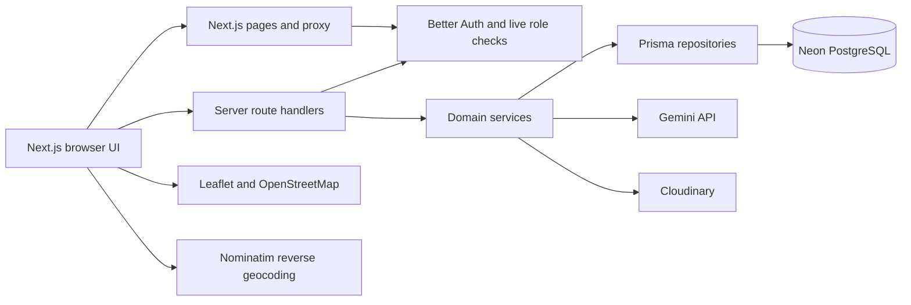

# Smart Municipal Assistant with ECM

Smart Municipal Assistant with ECM is an academic municipal-service MVP for Jeddah. It gives Citizens a consistent way to report local issues, gives Managers a database-backed operational view, gives Field Crew a focused work-order workflow, and preserves resolved reports as searchable electronic records.

## Problem statement

Municipal reports are often fragmented across informal channels. This makes ownership, status visibility, field assignment, evidence collection, and long-term record retrieval difficult. This project demonstrates one coherent lifecycle from a Citizen's report to operational resolution and ECM archiving without attempting to reproduce a production government platform.

## Objectives

- Capture structured reports with a confirmed Jeddah district and coordinates.
- Keep Citizens informed through report lists, maps, voting, and status history.
- Support optional, advisory Gemini classification and duplicate suggestions.
- Give Managers live database KPIs, charts, filters, maps, reports, and work-order controls.
- Let assigned Field Crew start work, add completion evidence, and complete tasks.
- Require Manager approval before a report becomes `resolved`.
- Archive resolved reports as checksum-protected electronic records with retention metadata and audit events.

## Users and roles

| Role | Main responsibilities |
| --- | --- |
| `Citizen` | Register or sign in, select a report location, submit and track reports, view community reports, vote, and submit suggestions. |
| `Manager` | Review operational data, filter reports, create and assign work orders, review evidence, approve closure, and manage the ECM archive. |
| `Crew` | View assigned work orders, start work, upload completion evidence, add notes, and mark work complete. |

Role authority comes from the live PostgreSQL user record and the server-validated Better Auth session. Browser `localStorage` is not an authorization boundary.

## Implemented features

- Better Auth credential login with secure database sessions and exact `Citizen`, `Manager`, and `Crew` roles.
- PostgreSQL-backed reports, report history, attachments, votes, suggestions, work orders, assignments, and audit logs.
- Normal and Quick Photo Citizen reporting paths that share the same report-creation API.
- Atomic location confirmation: latitude, longitude, canonical district ID, and district name are selected together.
- Central district resolution for the configured Jeddah district reference list using supported Arabic and English names. The Al-Marwah case (`21.6113323, 39.1964940`, Nominatim `المروة`) has automated regression coverage; it has not been claimed as a manual browser verification.
- Optional Gemini advice for category, severity, reasoning, and possible duplicates. Citizens can accept or override every suggestion.
- OpenStreetMap/Leaflet maps and Nominatim reverse geocoding.
- Cloudinary storage for report images, completion evidence, and ECM JSON packages.
- Manager dashboard with database KPI cards, Recharts status/category charts, date/district/category/status filters, a Leaflet report map, a paginated report table, and work-order management.
- Field Crew task updates and completion-evidence uploads.
- Manager closure approval and ECM eligibility for resolved reports.
- Searchable ECM records with canonical JSON manifests, SHA-256 integrity checks, five-year retention dates, and archive audit events.

## Technology stack

| Layer | Technology |
| --- | --- |
| Web application | Next.js 16.0.3 App Router, React 19.2, TypeScript |
| UI and charts | Tailwind CSS, Radix UI components, Recharts |
| Maps | Leaflet, React Leaflet, OpenStreetMap tiles, Nominatim |
| Validation and tests | Zod, Vitest, ESLint |
| Authentication | Better Auth 1.6.23 with database-backed credential accounts and sessions |
| Database | PostgreSQL on Neon, Prisma 7.9.1, Neon Prisma adapter |
| AI assistance | Google Gen AI SDK (`@google/genai`) and a configured Gemini model |
| Object storage | Cloudinary for images, evidence, and raw ECM JSON documents |

## Architecture overview



The Next.js UI uses same-origin APIs. Route handlers enforce authentication, role checks, trusted-origin rules for mutations, and Zod contracts before calling domain services. Prisma uses the pooled `DATABASE_URL` at runtime; Prisma CLI migration commands use the direct `DIRECT_URL`. Database integration tests are guarded to use a distinct `TEST_DATABASE_URL`.

More detail is available in [the database schema](docs/database-schema.md), [the business workflow](docs/business-workflow.md), [the AI design](docs/ai-assistance.md), [the ECM architecture](docs/ecm-architecture.md), and [the UML/ERD diagrams](docs/diagrams.md).

## Prerequisites

- Windows PowerShell.
- Node.js and npm compatible with Next.js 16.
- A PostgreSQL/Neon database for the runtime and a direct migration connection.
- A separate test database branch for guarded integration tests.
- Cloudinary credentials for image/evidence upload and ECM storage.
- Optional Gemini credentials. Without them, manual report submission remains available.

## Environment configuration

Copy the placeholder file and replace values locally. Never commit `.env`.

```powershell
Copy-Item .env.example .env
```

| Variable | Purpose |
| --- | --- |
| `DATABASE_URL` | Pooled Neon URL used by the server-only Prisma runtime client. |
| `DIRECT_URL` | Direct PostgreSQL URL used by Prisma migration and seed commands. |
| `TEST_DATABASE_URL` | Direct URL for a separate guarded test branch. It must not identify either runtime production URL. |
| `BETTER_AUTH_SECRET` | High-entropy Better Auth signing secret. |
| `BETTER_AUTH_URL` | Exact public application origin. Local development normally uses the local application origin. |
| `BETTER_AUTH_TRUSTED_ORIGINS` | Comma-separated exact origins permitted for authenticated mutations. |
| `AUTH_TRUSTED_PROXY_CIDRS` | Trusted reverse-proxy IP/CIDR list for non-Vercel production. Leave it unset for a direct Vercel deployment with system environment variables enabled. |
| `CLOUDINARY_CLOUD_NAME` | Server-only Cloudinary account name. |
| `CLOUDINARY_API_KEY` | Server-only Cloudinary API key. |
| `CLOUDINARY_API_SECRET` | Server-only Cloudinary API secret. |
| `GEMINI_API_KEY` | Optional server-only Gemini API key. |
| `GEMINI_MODEL` | Optional Gemini model name used for report assistance. |
| `TEST_CITIZEN_PHONE` | Optional test-branch-only Citizen identifier for guarded credential provisioning. |
| `TEST_CITIZEN_PASSWORD`, `TEST_MANAGER_PASSWORD`, `TEST_CREW_PASSWORD` | Explicit test-branch-only passwords. They are never supplied by the normal seed. |

The example file contains placeholders only. Client code must never receive database, Better Auth, Cloudinary, or Gemini secrets.

## Installation and database setup

From the project directory in Windows PowerShell:

```powershell
npm.cmd ci
npm.cmd run db:format
npm.cmd run db:generate
npm.cmd run db:migrate:status
npm.cmd run db:migrate:deploy
```

`db:migrate:deploy` applies checked-in forward migrations using `DIRECT_URL`. Review migration status before deploying. Do not use the test URL as the runtime URL.

The deterministic seed is optional and create-only for existing stable fixture IDs; it does not create passwords or credential accounts:

```powershell
npm.cmd run db:seed
```

Staff credentials are an explicit operator action and are not provisioned by installation or seeding. Citizen accounts can be registered through the public Citizen registration flow. Test-only credential provisioning is guarded against production and requires the explicit `TEST_*` values.

## Run locally

```powershell
npm.cmd run dev
```

Open `http://localhost:3000`. Authentication environment values must use that same trusted local origin. To exercise object storage or Gemini assistance, supply the corresponding server-only credentials; manual reporting remains available when Gemini is not configured.

For a production build and local production server:

```powershell
npm.cmd run build
npm.cmd start
```

Production mode requires HTTPS-compatible Better Auth origins. Non-Vercel deployments also require trusted-proxy CIDRs; direct Vercel deployments use Vercel's sanitized single `X-Forwarded-For` value and must keep system environment variables enabled.

## Demonstration workflow

1. Register or sign in as a Citizen.
2. Create a report, explicitly confirm its map location, optionally request Gemini advice, override any suggestion if needed, and submit.
3. Confirm that the report appears in the Citizen report list, tracking view, and map.
4. Sign in as a Manager, use the dashboard filters and charts, create a work order, and assign a Crew user.
5. Sign in as the assigned Crew user, start work, upload completion evidence, and mark the work order complete.
6. Return as Manager, inspect the evidence, approve report closure, and open the ECM archive.
7. Archive the resolved report, search for the ECM record, open its JSON package, and run **Verify integrity**.

## Verification commands

```powershell
npm.cmd run lint
npx.cmd tsc --noEmit --incremental false
npx.cmd prisma validate
npm.cmd test
npm.cmd run build
git diff --check
```

Focused suites are also available, including `npm.cmd run test:auth`, `test:reports:3a1`, `test:reports:3a2`, `test:phase3b`, `test:phase4`, `test:ecm`, and `test:ai`. Database integration tests require the guarded test branch and may fail independently when Neon connectivity is unavailable.

## Academic scope and limitations

This is a practical academic MVP, not a production government platform. It deliberately excludes PostGIS, real SMS/OTP, external municipal operational systems, legal holds, WORM storage, offline synchronization, route optimization, CSV/PDF export, automatic retention disposal, and production-scale disaster recovery. Gemini advice is optional and non-authoritative. Nominatim district resolution only accepts configured canonical districts and rejects ambiguous or unsupported results.

In summary, the project demonstrates a complete academic municipal-record lifecycle while keeping each authority explicit: Citizens confirm and submit, Managers coordinate and approve, Crew execute, and ECM preserves the resolved snapshot.

## Documentation index

- [Personas](docs/personas.md)
- [Business workflow](docs/business-workflow.md)
- [Database schema](docs/database-schema.md)
- [Data dictionary](docs/data-dictionary.md)
- [AI assistance](docs/ai-assistance.md)
- [External services](docs/external-services.md)
- [ECM architecture](docs/ecm-architecture.md)
- [Authentication façade](docs/authentication-facade.md)
- [UML and ERD diagrams](docs/diagrams.md)
