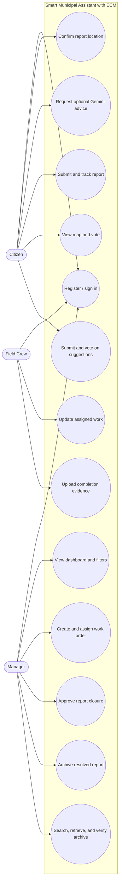
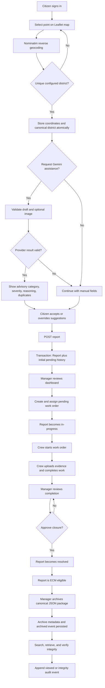
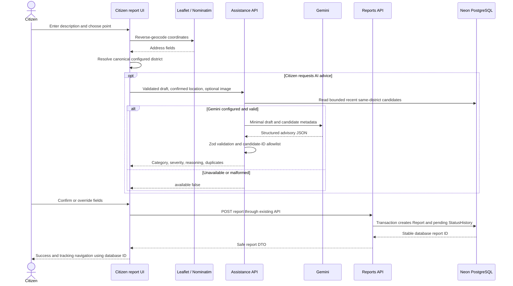
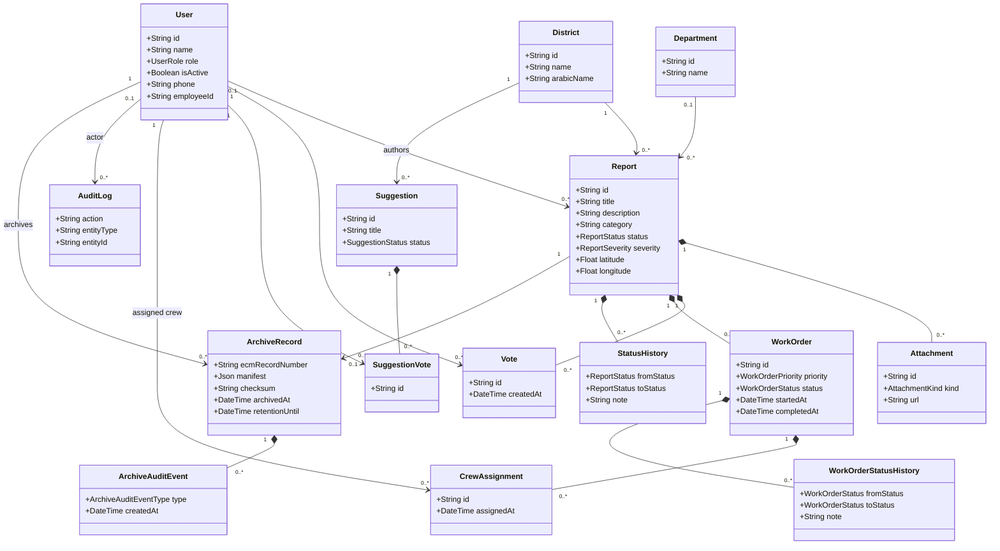
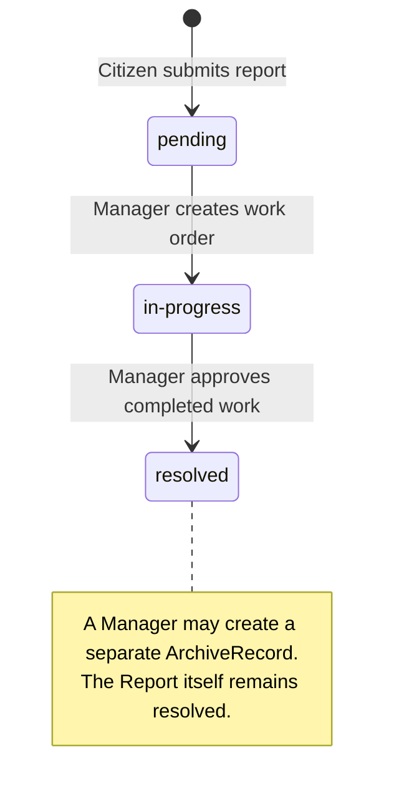
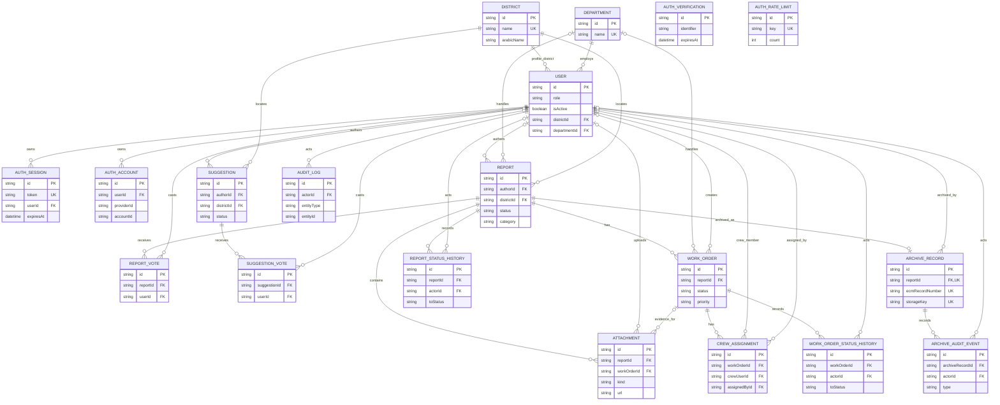

# UML and database diagrams

These Mermaid diagrams are derived from the implemented roles, routes, services, state enums, and Prisma entities. They intentionally omit infrastructure details when those details would make the academic view unreadable.

## 1. Use Case Diagram



## 2. Activity Diagram — full report lifecycle



## 3. Sequence Diagram — report submission and AI assistance



## 4. Sequence Diagram — work order, closure, and ECM

```mermaid
sequenceDiagram
  actor M as Manager
  actor C as Field Crew
  participant D as Manager dashboard API
  participant W as Crew work-order API
  participant DB as Neon PostgreSQL
  participant CL as Cloudinary
  participant E as ECM service

  M->>D: Create work order and assign Crew
  D->>DB: Transaction creates order, assignment, histories, audit
  DB-->>D: pending work order; report in-progress
  C->>W: Start assigned work
  W->>DB: active status, startedAt, history, audit
  C->>W: Upload completion evidence
  W->>CL: Store validated evidence image
  W->>DB: Create same-report WorkOrder Attachment
  C->>W: Complete assigned work
  W->>DB: completed status, completedAt, history, audit
  M->>D: Approve report closure
  D->>DB: Validate completed order; set report resolved
  M->>E: Archive resolved report
  E->>DB: Read report snapshot and related evidence
  E->>E: Canonical JSON and SHA-256
  E->>CL: Upload raw JSON and read it back
  E->>E: Verify stored checksum
  E->>DB: Create ArchiveRecord and ARCHIVED event atomically
  M->>E: Verify integrity
  E->>CL: Read retained JSON bytes
  E->>DB: Append INTEGRITY_VERIFIED or INTEGRITY_FAILED event
```

## 5. Class / Domain Diagram



## 6. Report State Diagram



`archived` is the `ArchiveRecord.status`; it is not an additional `Report.status`. The Report remains `resolved` after archival.

## 7. Database ERD



`AuthVerification` and `AuthRateLimit` are independent Better Auth infrastructure tables and therefore have no application foreign-key line in this ERD.
