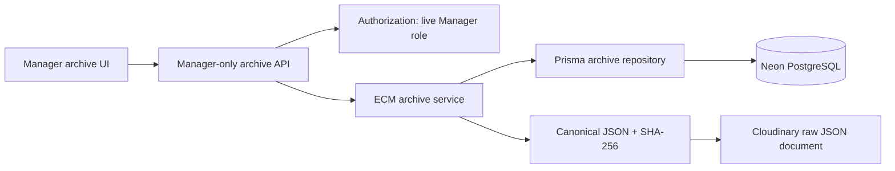
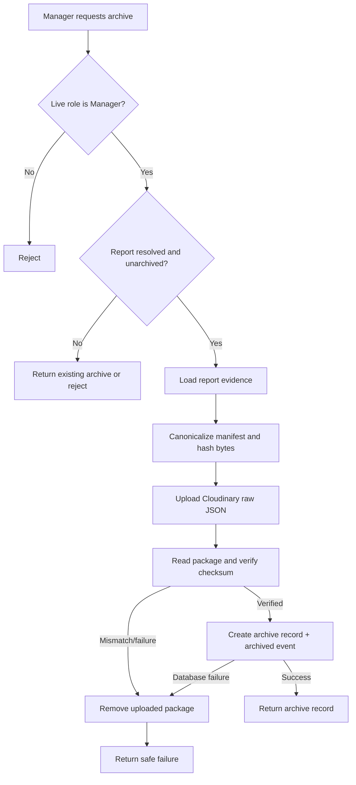
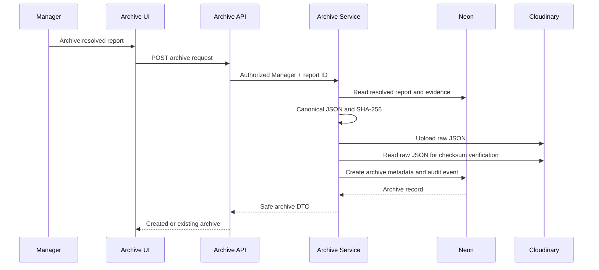

# ECM Archiving MVP

## Purpose and scope

The Smart Municipal Assistant treats every report as an electronic municipal record during its operational lifecycle. When a report reaches `resolved`, this MVP can capture its final evidence as a Manager-only archive snapshot. It stores a canonical JSON package in Cloudinary raw storage and records its metadata, SHA-256 checksum, retention date, and audit trail in Neon PostgreSQL.

The scope is intentionally limited to application-level immutable snapshots, search, retrieval, and checksum verification. It does not integrate an external ECM product and does not implement legal holds, WORM storage, notifications, exports, automatic archival, or automatic retention disposal.

## Eligibility and authority

- The caller must have a live, active database `Manager` role.
- The Report must have operational status `resolved`.
- The Report must not already have an `ArchiveRecord`.
- `ArchiveRecord.reportId` is unique, so only one archive record can exist for a Report.
- Archived reports no longer appear in the eligible-resolved list but remain retrievable through archive search.

## Workflow

1. A Manager selects a report whose operational status is `resolved`.
2. The service loads the report, status timeline, attachments, votes, work orders, Crew assignments, completion evidence, and relevant dates.
3. It creates a stable-key JSON manifest and calculates its SHA-256 checksum.
4. The JSON bytes are uploaded as a Cloudinary raw document.
5. The stored document is read back and its SHA-256 checksum is compared with the original.
6. A single `ArchiveRecord` and its `archived` audit event are committed atomically in Neon.
7. If storage verification or database persistence fails, the uploaded raw document is removed.
8. Managers can search by ECM number, report text, or district, inspect metadata and the manifest, open the retained package, and run **Verify integrity**.
9. Opening a package appends `VIEWED`. Integrity checks append `INTEGRITY_VERIFIED` or `INTEGRITY_FAILED`, preserving the actor and timestamp.

The archive list and events persist in PostgreSQL across application restarts; the JSON document persists in Cloudinary and is referenced by its unique storage key and secure URL.

## Archive metadata and data dictionary

| Field | Meaning |
| --- | --- |
| `ecmRecordNumber` | Unique human-readable ECM reference. |
| `reportId` | The operational report associated with this snapshot; only one archive is permitted per report. |
| `reportTitle`, `districtName` | Indexed snapshot metadata used for archive search. |
| `manifest` | Canonical JSON snapshot of the resolved report and related municipal evidence, retained in the database as archive metadata. |
| `storageKey` | Cloudinary raw-document public identifier. |
| `documentUrl` | Secure HTTPS URL for the stored JSON package. |
| `checksum` | SHA-256 of the canonical JSON byte sequence. |
| `provider` | Storage provider identifier, currently `cloudinary`. |
| `archivedAt` | Time at which the record snapshot was created. |
| `retentionUntil` | Archive retention deadline, five years after archiving. |
| `archivedById` | Stable database ID of the Manager who archived the report. |
| `ArchiveAuditEvent` | Application append-only archive event for archive creation, view, successful verification, or failed verification. |

## Retention and immutability rules

- Only reports in the terminal `resolved` state may be archived.
- `reportId`, `ecmRecordNumber`, and `storageKey` are unique.
- The archive service never exposes update or delete operations for `ArchiveRecord` or its manifest.
- The operational report is protected by a restrictive foreign key once archived, preventing deletion that would sever archive provenance.
- The JSON manifest is generated once from a stable key ordering. Later operational changes do not alter it.
- The default retention period is five years. This MVP records the deadline but does not delete records automatically.

## Integrity verification and audit lifecycle

The checksum covers the exact canonical JSON byte sequence uploaded at archive time. The service uses stable key ordering, computes SHA-256, uploads the raw JSON, reads the stored bytes back, and compares the checksum before creating the database archive row. A later **Verify integrity** action reads the retained Cloudinary bytes again and compares them with `ArchiveRecord.checksum`.

Audit event values are exactly:

- `archived`: created atomically with the ArchiveRecord;
- `viewed`: recorded when a Manager asks to open the stored package;
- `integrity-verified`: the retained bytes match the stored checksum; and
- `integrity-failed`: the object cannot be read or its bytes no longer match.

These events complement the operational `AuditLog`; they are stored in the dedicated `ArchiveAuditEvent` table and returned with archive detail.

## Immutability scope and limitations

“Immutable” in this MVP means that the archive service generates the manifest once and exposes no update or delete endpoint for `ArchiveRecord`, its manifest, or its audit events. Restrictive foreign keys protect the Report and archiving Manager references, and checksum verification detects a changed or unavailable Cloudinary package.

This is not hardware-enforced or provider-enforced WORM retention. A database/cloud administrator with out-of-band access could alter data, and the checksum stored in the same database is not an external trust anchor. The retention date is metadata rather than an automatic disposal or legal-hold engine. These limits are appropriate to the approved academic MVP and must not be presented as regulatory compliance.

## Component diagram

## Activity diagram

## Sequence diagram

