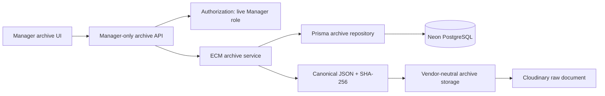
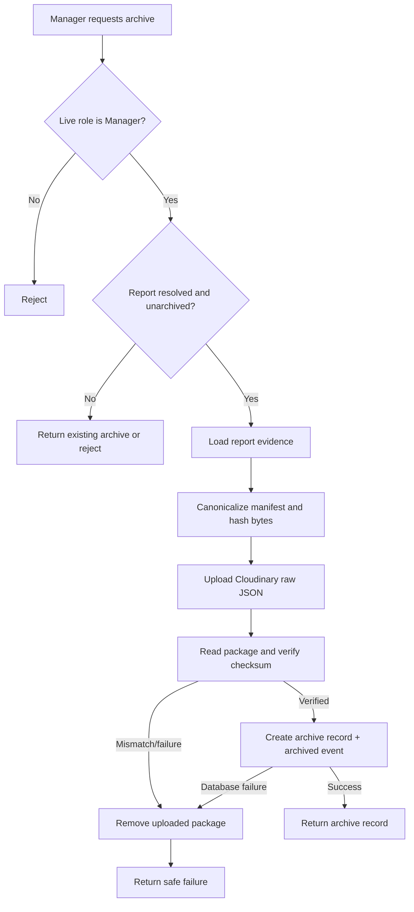
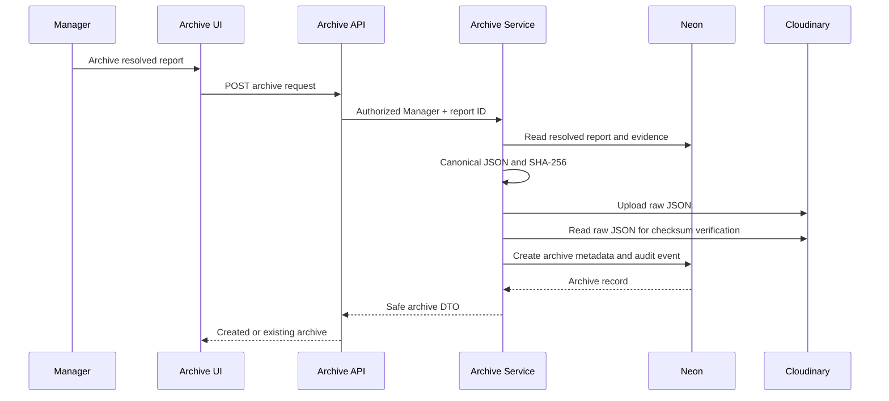

# ECM Archiving MVP

## Purpose and scope

The Smart Municipal Assistant treats a resolved municipal report as an electronic record. This MVP provides a Manager-only, database-backed archive for the final report state. It stores a canonical JSON package in Cloudinary raw storage and records its metadata, checksum, retention date, and audit trail in Neon PostgreSQL.

The scope is intentionally limited to immutable report snapshots, search, retrieval, and checksum verification. It does not implement legal holds, external ECM products, notifications, exports, or automatic archival.

## Workflow

1. A Manager selects a report whose operational status is `resolved`.
2. The service loads the report, status timeline, attachments, votes, work orders, Crew assignments, completion evidence, and relevant dates.
3. It creates a stable-key JSON manifest and calculates its SHA-256 checksum.
4. The JSON bytes are uploaded as a Cloudinary raw document.
5. The stored document is read back and its SHA-256 checksum is compared with the original.
6. A single `ArchiveRecord` and its `archived` audit event are committed atomically in Neon.
7. If storage verification or database persistence fails, the uploaded raw document is removed.
8. Managers can search, inspect, open, and verify the retained package. Views and integrity checks append archive audit events.

## Archive metadata and data dictionary

| Field | Meaning |
| --- | --- |
| `ecmRecordNumber` | Unique human-readable ECM reference. |
| `reportId` | The operational report associated with this snapshot; only one archive is permitted per report. |
| `reportTitle`, `districtName` | Indexed snapshot metadata used for archive search. |
| `manifest` | Immutable canonical JSON snapshot of the resolved report and related municipal evidence. |
| `storageKey` | Cloudinary raw-document public identifier. |
| `documentUrl` | Secure HTTPS URL for the stored JSON package. |
| `checksum` | SHA-256 of the canonical JSON byte sequence. |
| `provider` | Storage provider identifier, currently `cloudinary`. |
| `archivedAt` | Time at which the record snapshot was created. |
| `retentionUntil` | Archive retention deadline, five years after archiving. |
| `archivedById` | Stable database ID of the Manager who archived the report. |
| `ArchiveAuditEvent` | Append-only archive event for archive creation, view, successful verification, or failed verification. |

## Retention and immutability rules

- Only reports in the terminal `resolved` state may be archived.
- `reportId`, `ecmRecordNumber`, and `storageKey` are unique.
- The archive service never exposes update or delete operations for `ArchiveRecord` or its manifest.
- The operational report is protected by a restrictive foreign key once archived, preventing deletion that would sever archive provenance.
- The JSON manifest is generated once from a stable key ordering. Later operational changes do not alter it.
- The default retention period is five years. This MVP records the deadline but does not delete records automatically.

## Component diagram

## Activity diagram

## Sequence diagram

